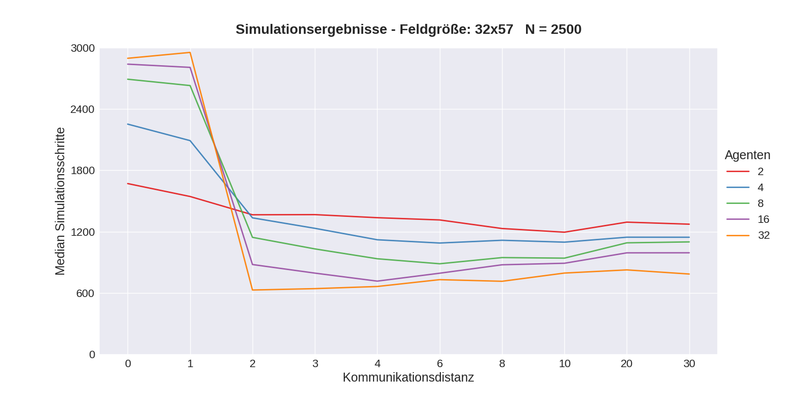
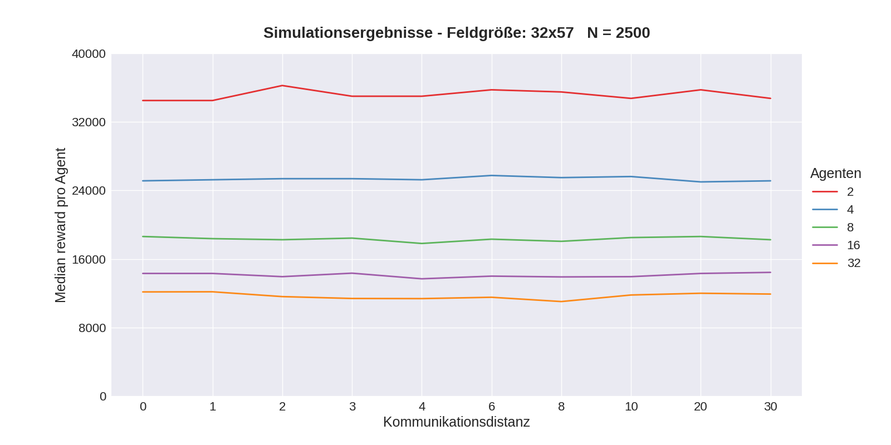

<h1 align="center">wumpus-detectives</h1>

<p align="center">
<a href="https://github.com/meetunix/wumpus-detectives/blob/main/LICENSE" title="License">
</a>
</p>

[German README here](README_DE.md)


WumpusDetectives is a multi-agent framework for the simulation of an extended [wumpus world](https://de.wikipedia.org/wiki/Wumpus-Welt).
The world is simulated by the wumpusMonitor.
The agents (wumpusDetective) can communicate with each other and with the monitor via a simple TCP-based protocol.


## Showcase


Summary of a wumpus world: pits (P) are surrounded by breezes (~), wumpi (W) are surrounded by stenches (~), gold (G), rocks (R), exits(O) and the moving agents (A). A wumpus world is fairly simple, each agent only knows the state it's currently on. If it steps on a wumpus or pit it dies. If it collects a gold piece it gains a reward. And leaving the world through the exit gains them a reward worth 10 gold pieces. 

On the left you can see the state of the entire world. And on the right you can see the currently known state of the world by a single agent. You may notice that it suddenly reveals a huge portion of the world, this occurs due to communication between agents. Furthermore agents have 10 arrows, which they can use to kill wumpi, possibly creating new paths.

The agents are non-learning, they are programmed to by a specific ruleset which they follow. They are always careful, so they collect all the gold they can, then kill wumpi which might reveal new information, and then they leave the world. 


## The Agents (wumpusDetective)

The agents are implemented in Java and can send messages to each other via a very simple
simple protocol (via TCP). Each agent needs an
installed Java Runtime Environment (JRE). The agent itself is a JAR file in
which already contains all dependencies. The currently used agent logic
*CarefulAgent* was developed by [LiquidFun](https://github.com/LiquidFun).
The rest of the project was developed by [meetunix](https://github.com/meetunix)

[**Documentation for wumpusDetective**](wumpusDetective/README.md)


## The Monitor (wumpusMonitor)

The monitor generates and manages the game world. It provides an interface for
agents to register to, report their state and get information about their current position.
The monitor also provides an HTTP endpoint that can be used to query the entire state of the world.
An external software can use this data for visualization. 
For each simulation parameters and results are are stored in the file `results_benchmark.csv` for later evaluation.


[**Documentation of the wumpusMonitor**](wumpusMonitor/README.md)


## Shared library (wumpusCore)

*wumpusCore* provides shared classes and is automatically compiled together with the other projects.


## Compilation

Java 11 and Apache Maven are required.

With the following command both projects (*wumpusDetective* and
*wumpusMonitor*) can be compiled.

```
mvn clean compile package
```

## Simulation and result visualization

The shell script `benchmark.sh` can be used to run simulations with different parameters.
For execution [GNU Parallel](https://www.gnu.org/software/parallel/) is used which takes care of the concurrent execution of the monitor and the agents.
GNU Parallel should be available as a package in every common Linux distribution, mostly under the name `parallel`.
Since a separate Java VM is started for each agent, the memory requirements are relatively high.
A simulation with 32 agents needs about 14 GiB memory on one system.
The agents can be ran on different systems, which means that simulations with more than 100 agents are possible.


The Python script `plot_results.py` visualizes the simulation results:

    plot_results.py results_benchmark.csv




## Visualization (wumpusVisualization)

Visualizes the simulated world.

See (TODO: add repository)
